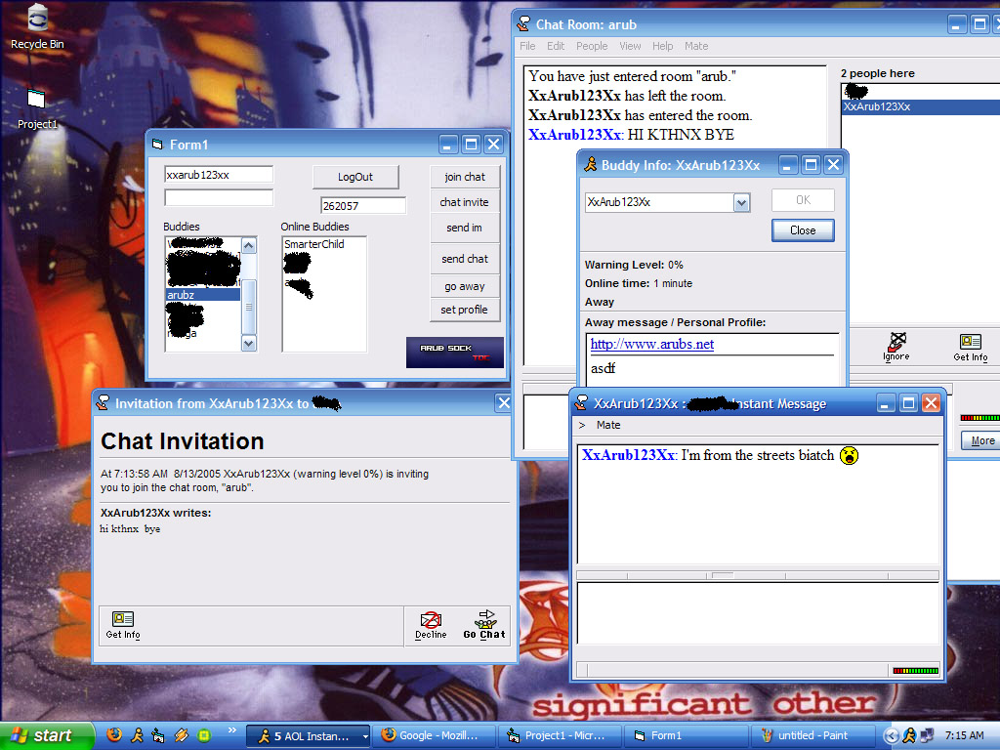



## ArubTOCSock

### Description

A Control for connecting to AIM with the toc protocol, can fully parse the buddylist.

**UPDATED TO WORK WITH TOC2**
 
### More Info
 

             |
---                |---
**Submitted On**   |2005-09-27 10:52:46
**By**             |[Arub](https://github.com/Planet-Source-Code/PSCIndex/blob/master/ByAuthor/arub.md)
**Level**          |Intermediate
**User Rating**    |5.0 (10 globes from 2 users)
**Compatibility**  |VB 6\.0
**Category**       |[Internet/ HTML](https://github.com/Planet-Source-Code/PSCIndex/blob/master/ByCategory/internet-html__1-34.md)
**World**          |[Visual Basic](https://github.com/Planet-Source-Code/PSCIndex/blob/master/ByWorld/visual-basic.md)
**Archive File**   |[ArubTOCSoc19407910162005\.zip](https://github.com/Planet-Source-Code/arub-arubtocsock__1-62163/archive/master.zip)

